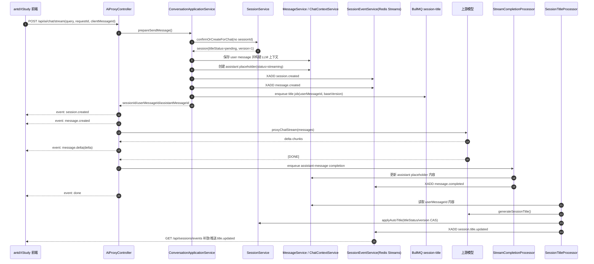
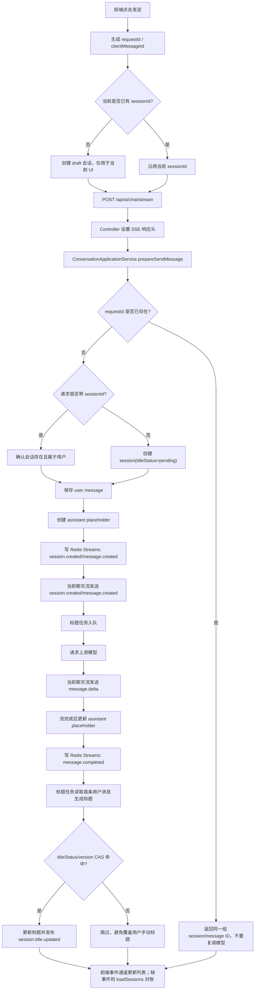

# 可靠会话生命周期设计文档

## 1. 背景与结论

当前聊天链路已经具备会话、消息持久化、流式响应、自动标题和前端会话列表更新能力，但整体仍偏“时序拼接”：多个关键状态变化依赖请求返回头、流式 chunk、内存 SSE、前端临时 Map 共同碰运气完成。

本设计将 `新发送消息 -> 新建/确认会话 -> 流式回复 -> 自动标题 -> 前端更新` 改造成可靠会话生命周期。核心结论：

- 主链必须可靠：会话确认、用户消息保存、assistant 占位消息创建是发起模型流之前的前置条件。
- 自动标题是派生数据：标题生成失败不能影响聊天主链，且不能覆盖用户手动修改。
- 前端通知必须可恢复：实时事件只是加速通道，最终一致性以 `GET /api/sessions` 和消息查询接口对账。
- 事件必须可重放：用 Redis Streams 承载会话可见事件，SSE 只负责把事件推给浏览器。
- 职责必须唯一：Controller、Application Service、Domain Service、Queue Processor、Realtime Gateway 各做一件事。

目标技术路线：

```text
Redis Streams + BullMQ + SSE

BullMQ          -> 后台任务：自动标题、异步补偿
Redis Streams   -> 可重放会话事件：session.created / title.updated / message.completed
SSE             -> 浏览器通知通道：读取 Redis Streams 后推送给前端
```

> **实施标记（2026-06-03）**
>
> - 实施位置：`ai-proxy-server/src/conversation/conversation-application.service.ts`
> - 具体原因：把“确认/创建会话、保存用户消息、创建 assistant 占位、发布事件、标题入队”收敛为一次发送消息用例，避免旧 Controller 直接拼接多个异步步骤。
> - 实施位置：`ai-proxy-server/src/session/session-event.service.ts`
> - 具体原因：用 Redis Streams 替换进程内 SSE Map，事件可带 ID 重放，断线/多实例时前端可以恢复。
> - 实施位置：`antdXStudy/src/store/chatThunks.ts`、`antdXStudy/src/service/chat.ts`、`antdXStudy/src/service/session-events.ts`
> - 具体原因：前端生成幂等 ID、消费显式 SSE 事件、保存 Last-Event-ID，并通过拉列表对账代替内存竞态补丁。

## 2. 当前链路锐评

当前链路的主要问题不是“异步自动标题”这个思路错误，而是缺少明确协议和状态机。

### 2.1 标题任务入队时机过早

当前 `POST /api/ai/chat/stream` 在解析或创建会话后立即入队自动标题任务，然后才保存用户消息和构建上下文。

风险：

- 标题生成成功，但用户消息保存失败，形成只有标题没有消息的异常会话。
- 标题任务读取到的事实不稳定，只能依赖请求参数，而不是已提交的首条消息。
- 标题任务与消息持久化之间没有因果顺序。

调整原则：只有当 `session + user message + assistant placeholder` 成功提交后，才能派发标题任务。

> **实施标记**
>
> - 实施位置：`ai-proxy-server/src/conversation/conversation-application.service.ts`
> - 具体原因：`prepareSendMessage()` 先调用 `confirmOrCreateForChat()`，再用 `prepareContext()` 保存用户消息，随后创建 assistant 空占位，最后才 `sessionTitleQueue.enqueue()`。
> - 关键注释：assistant 占位创建处说明“必须在请求模型前落库”，标题入队改为依赖 `userMessageId/baseVersion`。

### 2.2 不存在的 sessionId 被静默新建

当前 `resolveOrCreate()` 在前端传入的 `sessionId` 不存在时，会兜底创建一个新会话。

风险：

- 用户以为在旧会话继续聊，实际被后端悄悄分叉。
- 前端状态异常被掩盖，问题更难排查。
- 权限错误、删除状态、缓存过期、客户端 bug 被混成“新建会话”。

调整原则：传入 `sessionId` 时只允许确认既有会话。不存在、已删除或无权限都返回明确错误，不自动新建。

> **实施标记**
>
> - 实施位置：`ai-proxy-server/src/session/session.service.ts`
> - 具体原因：新增 `confirmOrCreateForChat()`，有 `sessionId` 时只调用 `findOneFresh()`；旧 `resolveOrCreate()` 仅保留兼容，但内部不再静默兜底创建。
> - 实施位置：`ai-proxy-server/src/ai-proxy/ai-proxy.controller.ts`
> - 具体原因：前置准备失败时通过当前 SSE 返回 `SESSION_NOT_FOUND`，并结束流。

### 2.3 前端 pendingTitleUpdates 是竞态补丁

当前前端用 `pendingTitleUpdates` 暂存先于 `syncSessionId` 到达的标题事件。

风险：

- 页面刷新后暂存区丢失。
- 多 Tab 之间不能共享。
- SSE 断线期间错过事件无法恢复。
- 事件乱序问题被转移到前端，且没有版本号判断。

调整原则：前端不做跨事件猜测。前端只消费标准事件，错过事件后通过 `Last-Event-ID` 补放；补放失败时重新拉取 `GET /api/sessions` 对账。

> **实施标记**
>
> - 实施位置：`antdXStudy/src/store/chatThunks.ts`
> - 具体原因：删除 `pendingTitleUpdates`，`session.title.updated` 找不到本地会话时触发 `loadSessions()` 对账，不再创建半成品会话。
> - 实施位置：`antdXStudy/src/service/session-events.ts`
> - 具体原因：保存 `sessionEvents.lastEventId`，重连时发送 `Last-Event-ID`。

### 2.4 SessionEventService 是内存广播

当前 `SessionEventService` 用进程内 `Map<userId, Set<Response>>` 保存 SSE 客户端。

风险：

- 多实例部署时，A 实例生成事件，B 实例上的浏览器连接收不到。
- 服务重启后事件丢失。
- 客户端断线期间没有补偿机制。
- 没有事件 ID、版本号和重放游标。

调整原则：可见业务事件先写 Redis Streams，再由任意实例上的 SSE Gateway 从 Redis Streams 读取并推送。

> **实施标记**
>
> - 实施位置：`ai-proxy-server/src/session/session-event.service.ts`
> - 具体原因：`publish()` 使用 `XADD user:{userId}:session-events MAXLEN ~ 5000`；`registerClient()` 使用 `XREAD BLOCK` 按游标补放和监听新事件。
> - 降级说明：Redis 写入失败只记录 warn，不中断聊天主链，符合“实时事件是增强通道”的设计。

### 2.5 autoGenerateSessionName 无法关闭

当前前端存在如下语义：

```typescript
autoGenerateSessionName: payload.autoGenerateSessionName || true
```

这会导致 `false` 被强制变成 `true`。

调整原则：布尔默认值使用空值合并。

```typescript
autoGenerateSessionName: payload.autoGenerateSessionName ?? true
```

> **实施标记**
>
> - 实施位置：`antdXStudy/src/service/chat.ts`
> - 具体原因：已改为 `payload.autoGenerateSessionName ?? true`，允许调用方显式传 `false`。
> - 实施位置：`ai-proxy-server/src/ai-proxy/ai-proxy.controller.ts`
> - 具体原因：后端默认值同步为 `dto.autoGenerateSessionName ?? true`，前后端语义一致。

## 3. 设计目标与非目标

### 3.1 设计目标

- 首次发送消息时，会话必须稳定创建，前端能立即拿到真实 `sessionId`。
- 流式响应期间，前端不依赖响应头猜测会话状态，而是消费标准 SSE 事件。
- 自动标题只能覆盖仍处于自动标题状态的会话标题。
- 断线、刷新、多 Tab、多后端实例下，会话列表最终一致。
- 所有可见状态变化都有事件 ID、事件类型、用户 ID、会话 ID 和版本信息。
- 请求具备幂等能力，同一 `requestId` 不重复创建会话和消息。
- 后端模块职责唯一，降低 controller 编排复杂度。

### 3.2 非目标

- 不在本阶段重构所有 AI provider adapter。
- 不在本阶段引入完整认证系统，但设计要求不能继续信任任意 `x-user-id` 作为长期方案。
- 不要求所有 token delta 写入 Redis Streams；高频 token 流仍可沿当前请求 SSE 直接返回。
- 不要求 Redis Streams 永久保存事件；它是短期重放通道，不替代数据库。

## 4. 成熟方案参考原则

成熟聊天产品通常采用以下原则，而不是把所有动作串成一条不可失败的同步链：

- 会话创建是主事实，标题是派生事实。
- 临时标题可以立即展示，智能标题异步替换。
- 实时事件不作为唯一数据源，列表接口始终可用于恢复。
- 事件带版本或更新时间，避免旧事件覆盖新状态。
- 后端写入使用幂等键，客户端重试不会制造重复消息。
- 用户手动行为优先级高于 AI 自动行为。

本项目落地时对应为：

```text
DB                       -> 权威事实
Redis Streams            -> 短期可重放事件日志
SSE                       -> 浏览器实时通道
BullMQ                    -> 后台派生任务
Frontend Redux Store      -> 当前页面投影，可随时由 DB 接口重建
```

## 5. 目标架构与事件流

### 5.1 总体架构

```text
antdXStudy
  |
  | POST /api/ai/chat/stream
  v
ChatStreamController
  |
  | validate dto / open SSE response
  v
ConversationApplicationService
  |
  |-- SessionService.confirmOrCreate()
  |-- MessageService.createUserMessage()
  |-- MessageService.createAssistantPlaceholder()
  |-- RealtimeEventPublisher.publish(session.created)
  |-- SessionTitleProducer.enqueueIfNeeded()
  |
  v
AiProxyService.proxyChatStream()
  |
  | token delta
  v
SSE response: message.delta
  |
  | stream complete
  v
MessageService.completeAssistantMessage()
  |
  v
RealtimeEventPublisher.publish(message.completed)


SessionTitleProcessor
  |
  | read first user message
  | generate title
  | compare titleStatus/version
  v
SessionService.applyAutoTitle()
  |
  v
RealtimeEventPublisher.publish(session.title.updated)


SessionEventGateway
  |
  | XREAD Redis Streams
  v
GET /api/sessions/events SSE
```

### 5.2 首次发送消息时序

```text
1. 前端生成 requestId、clientMessageId，发送 query。
2. 后端没有收到 sessionId，创建新 session，标题为 query 前 30 字，titleStatus=pending。
3. 后端创建 user message，记录 clientMessageId。
4. 后端创建 assistant placeholder。
5. 后端写 Redis Streams：session.created。
6. 后端在当前 chat stream 中先发送 event: session.created。
7. 后端确认这是首条消息后，入队 session-title job。
8. 后端请求上游模型，持续发送 event: message.delta。
9. 流完成后，后端保存 assistant 完整内容。
10. 后端写 Redis Streams：message.completed。
11. 标题任务完成后，CAS 更新 session title。
12. 后端写 Redis Streams：session.title.updated。
13. 前端收到标题事件后更新会话列表；若错过事件，重连或拉列表恢复。
```

### 5.3 既有会话发送消息时序

```text
1. 前端携带 sessionId、requestId、clientMessageId。
2. 后端校验 session 存在、未删除、属于当前用户。
3. 校验失败直接返回错误，不新建会话。
4. 后端保存 user message 和 assistant placeholder。
5. 后端流式返回 message.delta。
6. 流完成后更新 assistant message，并发布 message.completed。
7. 默认不触发自动标题，除非后续明确支持“重新生成标题”命令。
```

## 6. 职责唯一拆分

| 组件 | 唯一职责 | 不应该做的事 |
| --- | --- | --- |
| `ChatStreamController` | HTTP 入参、响应头、SSE response 生命周期 | 不直接创建 session，不生成标题，不写 Redis Streams |
| `ConversationApplicationService` | 编排一次“发送消息”用例 | 不直接拼 SSE 文本，不实现 DB 查询细节 |
| `SessionService` | 会话 CRUD、权限校验、标题状态更新 | 不调用 LLM，不管理 SSE client |
| `MessageService` | 消息创建、完成、失败、分页查询 | 不创建会话，不生成标题 |
| `ChatContextService` | 构建 LLM 上下文和附件上下文 | 不负责 session 创建策略 |
| `AiProxyService` | 调用上游模型并返回标准化流 | 不落库，不发业务事件 |
| `SessionTitleProducer` | 根据条件投递标题生成任务 | 不生成标题，不更新 session |
| `SessionTitleProcessor` | 生成标题并请求应用自动标题 | 不推 SSE，不直接操作前端事件连接 |
| `RealtimeEventPublisher` | 写 Redis Streams | 不保存业务表，不处理 SSE 连接 |
| `SessionEventGateway` | 从 Redis Streams 读取并转发 SSE | 不生成业务事件，不修改 DB |
| 前端 store | 消费事件并维护页面投影 | 不猜测事件因果，不保存跨刷新补丁状态 |

建议新增后端应用层模块：

```text
src/conversation/
  conversation.module.ts
  conversation-application.service.ts
  dto/send-message.dto.ts
```

也可以先放在 `ai-proxy` 内部过渡，但最终应从 `AiProxyController` 中移出业务编排。

## 7. API / SSE / Redis Streams 事件协议

### 7.1 POST /api/ai/chat/stream

保留现有接口，但请求体建议扩展：

```typescript
interface ChatStreamRequest {
  query: string;
  sessionId?: string;
  requestId: string;
  clientMessageId?: string;
  provider?: string;
  model?: string;
  credentialId?: string;
  temperature?: number;
  max_tokens?: number;
  fileIds?: string[];
  autoGenerateSessionName?: boolean;
}
```

字段语义：

- `requestId`：一次发送动作的幂等键，由前端生成 UUID。
- `clientMessageId`：前端乐观 user message ID，用于后端真实消息与前端消息对齐。
- `sessionId`：存在时表示继续既有会话；不存在时表示创建新会话。
- `autoGenerateSessionName`：默认 `true`，必须使用 `?? true`。

幂等约束：

- 同一用户下 `requestId` 唯一。
- 重复请求同一 `requestId` 时，返回同一组 `sessionId/userMessageId/assistantMessageId`。
- 若第一次请求已经完成，重复请求可以返回当前会话与消息状态，不再重复调用上游模型。

> **实施标记**
>
> - 实施位置：`ai-proxy-server/src/ai-proxy/dto/chat-stream.dto.ts`
> - 具体原因：新增 `requestId`、`clientMessageId` 字段，服务端允许缺省但推荐前端生成，避免重试重复创建会话和消息。
> - 实施位置：`antdXStudy/src/store/chatThunks.ts`、`antdXStudy/src/service/chat.ts`
> - 具体原因：发送前生成 `requestId/clientMessageId` 并写入请求体；本地乐观消息 metadata 也保留这两个 ID 便于排查。

### 7.2 Chat Stream SSE 事件

当前 `POST /api/ai/chat/stream` 响应仍为 `text/event-stream`，但不再只依赖 `data:` 传 OpenAI-like chunk，而是显式事件类型。

#### session.created

首次创建会话后立即发送。

```text
event: session.created
data: {"sessionId":"...","title":"帮我分析这段代码","titleStatus":"pending","createdAt":"2026-06-03T10:00:00.000Z","updatedAt":"2026-06-03T10:00:00.000Z","version":1}
```

#### message.created

用户消息和 assistant 占位创建后发送，用于前端对齐乐观消息。

```text
event: message.created
data: {"sessionId":"...","userMessageId":"...","assistantMessageId":"...","clientMessageId":"..."}
```

#### message.delta

模型 token 增量。该事件可以只走当前 chat stream，不强制写 Redis Streams。

```text
event: message.delta
data: {"sessionId":"...","messageId":"...","delta":"你好","role":"assistant"}
```

#### message.completed

assistant 完整消息落库后发送，并写入 Redis Streams。

```text
event: message.completed
data: {"sessionId":"...","messageId":"...","status":"done","updatedAt":"2026-06-03T10:00:08.000Z","version":3}
```

> **实施标记**
>
> - 实施位置：`ai-proxy-server/src/ai-proxy/utils/sse-transform.util.ts`
> - 具体原因：模型 token 改为显式 `event: message.delta`，同时 data 保留旧 `choices` 结构兼容 X SDK 演示页。
> - 实施位置：`ai-proxy-server/src/queue/processors/stream-completion.processor.ts`
> - 具体原因：流完成后更新 assistant 占位消息，写 `message.completed` 到 Redis Streams，并把幂等请求状态置为 `completed`。

#### session.title.updated

自动标题应用成功后发送，并写入 Redis Streams。

```text
event: session.title.updated
data: {"sessionId":"...","title":"代码分析建议","titleStatus":"auto","updatedAt":"2026-06-03T10:00:09.000Z","version":4}
```

#### error

错误事件必须区分可展示消息和错误码。

```text
event: error
data: {"code":"SESSION_NOT_FOUND","message":"会话不存在或已被删除","retryable":false}
```

错误约定：

- 会话确认失败：在调用上游模型前返回错误，不创建新会话。
- 模型流失败：发送 `error` 后结束流，assistant 消息标记为 error。
- 标题生成失败：不通过当前 chat stream 报错，只记录状态和日志。

### 7.3 GET /api/sessions/events

会话事件通道仍使用 SSE，但数据源改为 Redis Streams。

请求：

```http
GET /api/sessions/events?lastEventId=1717390000-0
Last-Event-ID: 1717390000-0
```

行为：

- 优先读取 `Last-Event-ID` 请求头。
- 请求头不存在时读取 `lastEventId` query。
- 都不存在时，从 `$` 开始只接收新事件。
- 若客户端传入旧 ID，先补发历史事件，再阻塞读取新事件。
- 每条 SSE 必须带 `id:` 字段，值为 Redis Streams event id。

示例：

```text
id: 1717390000-0
event: session.title.updated
data: {"sessionId":"...","title":"代码分析建议","version":4}
```

> **实施标记**
>
> - 实施位置：`ai-proxy-server/src/session/session.controller.ts`
> - 具体原因：`GET /api/sessions/events` 同时读取请求头 `Last-Event-ID` 和 query `lastEventId`，传给 Redis Streams Gateway。
> - 实施位置：`antdXStudy/src/service/session-events.ts`
> - 具体原因：浏览器消费每条 SSE 的 `id:` 并写入 localStorage，断线重连时带回。

### 7.4 Redis Streams 结构

按用户隔离 stream：

```text
stream key: user:{userId}:session-events
```

事件字段：

```typescript
interface RealtimeSessionEvent {
  eventType:
    | 'session.created'
    | 'session.updated'
    | 'session.deleted'
    | 'session.title.updated'
    | 'message.created'
    | 'message.completed'
    | 'message.failed';
  userId: string;
  sessionId: string;
  aggregateVersion: number;
  occurredAt: string;
  payload: Record<string, unknown>;
}
```

Redis 写入：

```text
XADD user:{userId}:session-events MAXLEN ~ 5000 * eventType ... payload ...
```

保留策略：

- 开发期可使用 `MAXLEN ~ 5000`。
- 生产期按用户规模调整，或切换为按租户/分片 stream。
- Redis Streams 不作为长期审计日志；长期事实仍在 PostgreSQL。

> **实施标记**
>
> - 实施位置：`ai-proxy-server/src/session/session-event.service.ts`
> - 具体原因：按用户 stream 写入 `eventType/userId/sessionId/aggregateVersion/occurredAt/payload`；SSE Gateway 从同一 stream 读取并输出 `id/event/data`。

## 8. 数据模型建议

当前 `Session` 只有 `title`，不足以表达自动标题状态和事件版本。建议新增字段：

```prisma
model Session {
  id          String   @id @default(uuid()) @db.Uuid
  userId      String   @map("user_id") @db.Uuid
  title       String?
  titleStatus String   @default("manual") @map("title_status")
  version     Int      @default(1)
  isDeleted   Boolean  @default(false) @map("is_deleted")
  createdAt   DateTime @default(now()) @map("created_at")
  updatedAt   DateTime @updatedAt @map("updated_at")
}
```

`titleStatus` 取值：

| 状态 | 含义 |
| --- | --- |
| `pending` | 临时标题，等待自动生成 |
| `auto` | AI 自动生成标题 |
| `manual` | 用户手动修改标题 |
| `failed` | 自动标题生成失败，仍展示 fallback 标题 |

建议新增请求幂等表：

```prisma
model ChatRequest {
  id                 String   @id @default(uuid()) @db.Uuid
  userId             String   @map("user_id") @db.Uuid
  requestId          String   @map("request_id")
  sessionId          String   @map("session_id") @db.Uuid
  userMessageId      String   @map("user_message_id") @db.Uuid
  assistantMessageId String   @map("assistant_message_id") @db.Uuid
  status             String
  createdAt          DateTime @default(now()) @map("created_at")
  updatedAt          DateTime @updatedAt @map("updated_at")

  @@unique([userId, requestId])
  @@index([sessionId, createdAt])
  @@map("chat_requests")
}
```

如果不想立刻新增表，过渡方案是在 `Message.metadata` 中记录 `requestId/clientMessageId`，但长期建议独立建表，避免幂等查询依赖 JSONB。

> **实施标记**
>
> - 实施位置：`ai-proxy-server/prisma/schema.prisma`
> - 具体原因：`Session` 已增加 `titleStatus/version`，新增 `ChatRequest` 幂等表。
> - 实施位置：`ai-proxy-server/prisma/migrations/20260603070000_reliable_chat_lifecycle/migration.sql`
> - 具体原因：为现有数据库补 `sessions.title_status`、`sessions.version` 和 `chat_requests` 表结构。

## 9. 标题生成状态机

### 9.1 状态流转

```text
pending
  | title job success
  v
auto

pending
  | title job failed
  v
failed

pending / auto / failed
  | user manually renames
  v
manual

manual
  | title job success
  v
manual  (保持不变)
```

### 9.2 自动标题写入规则

自动标题更新必须使用 CAS 条件：

```text
where:
  session.id = sessionId
  session.userId = userId
  session.titleStatus in ('pending', 'failed')
  session.version = job.baseVersion
```

成功后：

```text
title = generatedTitle
titleStatus = auto
version = version + 1
updatedAt = now()
```

失败后：

```text
title 保持 fallback
titleStatus = failed
version = version + 1
```

用户手动改标题：

```text
title = userTitle
titleStatus = manual
version = version + 1
```

> **实施标记**
>
> - 实施位置：`ai-proxy-server/src/session/session.service.ts`
> - 具体原因：`applyAutoTitle()` 使用 `id/userId/titleStatus/version` 条件更新，未命中则返回 `null`，不覆盖用户手动标题。
> - 实施位置：`ai-proxy-server/src/ai-proxy/processors/session-title.processor.ts`
> - 具体原因：标题任务通过 `userMessageId` 读取已提交用户消息，生成后用 `baseVersion` 调用 CAS 更新。

### 9.3 标题任务 payload

```typescript
interface SessionTitleJob {
  sessionId: string;
  userId: string;
  userMessageId: string;
  baseVersion: number;
  provider: string;
  model: string;
  credentialId?: string;
}
```

标题任务不再依赖原始请求里的 `query`，而是读取已提交的首条用户消息。

## 10. 前端状态同步策略

### 10.1 前端发送消息

前端发送前生成：

```typescript
const requestId = crypto.randomUUID();
const clientMessageId = crypto.randomUUID();
```

首次会话可以继续乐观显示一个 draft 会话，但必须遵守：

- draft 会话只用于当前 UI 立即反馈。
- 一旦收到 `session.created`，用真实 `sessionId` 替换 draft。
- 不再使用 `pendingTitleUpdates` 这类跨事件暂存补丁。
- `session.title.updated` 找不到实体时，不创建重复实体，而是触发一次 `loadSessions()` 对账。

> **实施标记**
>
> - 实施位置：`antdXStudy/src/store/chatThunks.ts`
> - 具体原因：`sendCurrentMessage()` 生成 `requestId/clientMessageId`，收到 `message.created` 后用后端真实 ID 替换本地乐观消息 ID。
> - 实施位置：`antdXStudy/src/store/messageStore/index.ts`
> - 具体原因：新增 `replaceMessageId()`，用于把本地临时消息与后端真实消息对齐。

### 10.2 前端消费事件

前端应统一解析 SSE 事件：

```typescript
type SessionRealtimeEvent =
  | { type: 'session.created'; payload: SessionCreatedPayload; eventId: string }
  | { type: 'message.created'; payload: MessageCreatedPayload; eventId: string }
  | { type: 'message.delta'; payload: MessageDeltaPayload; eventId?: string }
  | { type: 'message.completed'; payload: MessageCompletedPayload; eventId: string }
  | { type: 'session.title.updated'; payload: SessionTitleUpdatedPayload; eventId: string }
  | { type: 'error'; payload: StreamErrorPayload; eventId?: string };
```

状态更新规则：

- `session.created`：upsert 会话，并保存真实 `sessionId`。
- `message.created`：把乐观消息 ID 与后端消息 ID 对齐。
- `message.delta`：只追加到指定 assistant message。
- `message.completed`：标记 assistant message done。
- `session.title.updated`：仅当事件版本大于本地版本时更新。
- 未知会话事件：触发 `loadSessions()`，不在本地猜测创建完整实体。

### 10.3 断线恢复

前端保存最近消费的 `lastEventId`：

```text
localStorage.sessionEvents.lastEventId = "1717390000-0"
```

重连时：

```http
GET /api/sessions/events
Last-Event-ID: 1717390000-0
```

如果后端返回事件过期或 gap：

- 前端清空 `lastEventId`。
- 重新调用 `loadSessions()`。
- 当前打开会话调用 `loadMessages(currentSessionId)`。

> **实施标记**
>
> - 实施位置：`antdXStudy/src/service/session-events.ts`
> - 具体原因：保存并回传 `Last-Event-ID`，支持事件补放。
> - 实施位置：`antdXStudy/src/store/chatThunks.ts`
> - 具体原因：未知事件或本地缺会话时触发 `loadSessions()`，当前打开会话仍通过消息接口恢复权威数据。

## 11. 失败场景与恢复策略

| 场景 | 处理策略 | 用户体验 |
| --- | --- | --- |
| 会话创建失败 | 不调用上游模型，返回 `error` | 显示发送失败，可重试 |
| 传入 sessionId 不存在 | 返回 `SESSION_NOT_FOUND` | 提示会话不存在，不新建隐藏会话 |
| 用户消息保存失败 | 不调用上游模型 | 用户消息标记失败 |
| 上游模型流失败 | assistant 标记 error，发布 `message.failed` | 已收到内容可保留，展示错误 |
| assistant 落库失败 | 同步 fallback 或入补偿队列，记录告警 | 前端可先展示，刷新后可能进入恢复态 |
| 标题任务入队失败 | 主链继续，标题保持 pending/failed | 会话仍可聊天 |
| 标题生成失败 | titleStatus=failed，保留 fallback 标题 | 不打断聊天 |
| 标题事件推送失败 | Redis Streams 保留，前端重连补发 | 无需用户感知 |
| Redis Streams 不可用 | 聊天主链可降级，前端靠拉列表恢复 | 实时列表更新延迟 |
| BullMQ 不可用 | 标题生成暂停，主链继续 | 临时标题保留 |

降级原则：

- PostgreSQL 是主链强依赖。
- Redis/BullMQ 是增强能力依赖；短时不可用时，聊天主链可以继续，但必须记录日志和健康状态。
- 如果业务要求标题必须生成，则可以把 BullMQ 提升为强依赖，但当前不建议。

## 12. 迁移步骤

### Step 1：修复低风险行为

- 将前端 `autoGenerateSessionName: payload.autoGenerateSessionName || true` 改为 `?? true`。
- 修改 `resolveOrCreate()` 语义：
  - 无 `sessionId`：创建新会话。
  - 有 `sessionId`：只确认会话；不存在或无权限直接抛错。
- 删除或降级 debug ingest 日志代码，避免污染业务 reducer。

### Step 2：补齐状态字段和幂等能力

- `Session` 新增 `titleStatus` 和 `version`。
- 新增 `ChatRequest` 幂等表，或短期在 message metadata 中建立幂等查询。
- 前端请求新增 `requestId` 和 `clientMessageId`。

### Step 3：抽出发送消息应用服务

- 新建 `ConversationApplicationService`。
- Controller 只保留 DTO 校验、SSE response 管理和调用应用服务。
- 应用服务负责：
  - 确认或创建会话。
  - 创建 user message。
  - 创建 assistant placeholder。
  - 构建 LLM 上下文。
  - 触发标题任务。
  - 调用模型流。

### Step 4：标准化 chat stream SSE

- 为 `POST /api/ai/chat/stream` 增加显式 `event:`。
- 优先发送 `session.created/message.created`，再发送 `message.delta`。
- 保留兼容层：短期前端可同时支持旧的 `data: { choices }` 和新事件格式。

### Step 5：引入 Redis Streams 事件发布

- 新建 `RealtimeEventPublisher`。
- 将 `session.created`、`message.completed`、`message.failed`、`session.title.updated` 写入 `user:{userId}:session-events`。
- 每条事件带 `aggregateVersion` 和 `occurredAt`。

### Step 6：改造 SessionEventGateway

- `GET /api/sessions/events` 不再依赖内存 Map。
- 支持 `Last-Event-ID` 和 `lastEventId`。
- 使用 `XREAD BLOCK` 从 Redis Streams 读取事件并写 SSE。
- SSE 输出包含 `id:`、`event:`、`data:`。

### Step 7：改造自动标题

- 标题任务只在首条用户消息提交成功后入队。
- 任务 payload 携带 `userMessageId` 和 `baseVersion`。
- Processor 读取 DB 中的首条消息生成标题。
- 使用 `titleStatus/version` CAS 更新，防止覆盖用户手动标题。
- 标题更新成功后发布 `session.title.updated`。

### Step 8：前端移除竞态补丁

- 移除 `pendingTitleUpdates`。
- 统一 SSE 事件解析器。
- 使用 `eventId/version` 做更新判断。
- 收到未知 session 的标题事件时触发 `loadSessions()` 对账。
- 重连时携带 `Last-Event-ID`。

> **实施标记**
>
> - 实施位置：`ai-proxy-server/src/ai-proxy/ai-proxy.controller.ts`、`ai-proxy-server/src/conversation/conversation-application.service.ts`、`ai-proxy-server/src/session/session-event.service.ts`
> - 具体原因：后端 8 个迁移步骤中的主链顺序、事件协议、Redis Streams 重放、自动标题 CAS 已落地。
> - 实施位置：`antdXStudy/src/store/chatThunks.ts`、`antdXStudy/src/service/chat.ts`、`antdXStudy/src/service/session-events.ts`
> - 具体原因：前端已生成幂等键、消费标准事件、保存 Last-Event-ID，并删除跨事件暂存补丁。
> - 验证位置：`ai-proxy-server` 执行 `pnpm build` 通过；`antdXStudy` 执行 `pnpm build` 通过。

## 13. 新建会话时序图与调用流程

### 13.1 新建会话时序图



### 13.2 新建会话调用流程图



## 14. 测试与验收标准

### 14.1 后端测试

必须覆盖：

- 首次发送消息成功：
  - 创建 session。
  - 创建 user message。
  - 创建 assistant placeholder。
  - 发送 `session.created`。
  - 标题任务在消息提交后入队。

- 既有会话发送：
  - session 存在且属于用户时成功。
  - session 不存在时返回 `SESSION_NOT_FOUND`。
  - session 属于其他用户时返回无权限或不存在。
  - 不自动创建新会话。

- 自动标题：
  - `pending -> auto` 成功。
  - 生成失败时 `pending -> failed`。
  - 用户手动修改后，标题任务不能覆盖 `manual`。
  - job 重试不会重复更新标题版本。

- Redis Streams：
  - publish 后可通过 stream ID 读取。
  - `Last-Event-ID` 后的事件可以补发。
  - Redis 暂不可用时有明确日志和降级策略。

- 幂等：
  - 同一 `requestId` 重试不会重复创建 session。
  - 同一 `requestId` 重试不会重复创建 user message。

### 14.2 前端测试

必须覆盖：

- 首次发送消息时，前端先展示临时会话，收到 `session.created` 后替换为真实会话。
- 收到 `session.title.updated` 后更新侧边栏标题。
- 标题事件先到但本地没有 session 时，不创建重复实体，而是拉取会话列表。
- SSE 断线重连时携带 `Last-Event-ID`。
- 补发事件后，本地 `version` 较旧才更新。
- 多 Tab 场景下，一个 Tab 新建会话，另一个 Tab 最终能看到标题更新。

### 14.3 手工验收场景

- 首次发消息成功：前端先出现临时标题，几秒内替换为 AI 标题。
- 标题生成失败：聊天正常完成，标题保持 fallback，不影响继续对话。
- 删除一个会话后继续向旧 `sessionId` 发送：后端返回错误，不创建隐藏会话。
- 发送过程中刷新页面：重新进入后会话和消息能从后端恢复。
- 断开 `/api/sessions/events` 后再恢复：遗漏的标题事件能补上。
- 用户手动改标题后，再晚到的自动标题不会覆盖。
- 快速重复点击发送或网络重试：不会出现重复会话或重复用户消息。

## 15. 实施优先级

建议按风险和收益排序：

1. 修复 `?? true` 和 `sessionId` 静默新建问题。
2. 引入 `titleStatus/version`，保证自动标题不覆盖用户手动修改。
3. 抽出 `ConversationApplicationService`，收敛 controller 职责。
4. 标准化 chat stream SSE 事件。
5. 引入 Redis Streams 和 `Last-Event-ID` 补发。
6. 前端移除 `pendingTitleUpdates`，改为事件协议 + 对账。
7. 增加幂等表和完整重试语义。

其中 1-2 是可靠性底线，3-4 是结构治理，5-7 是成熟化增强。

## 16. 最终目标形态

最终系统应满足：

```text
聊天主链可靠提交
  +
自动标题异步派生
  +
事件通知可重放
  +
前端状态可对账
  +
模块职责唯一
```

到这个阶段，当前链路就不再是“新消息触发一串容易乱序的副作用”，而是一个清晰的会话生命周期状态机。实时体验仍然轻快，但不再依赖运气。
