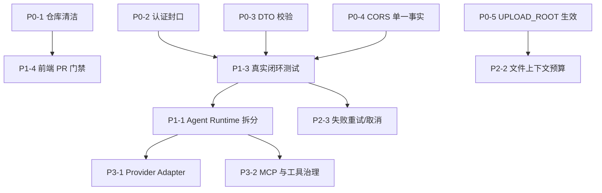

# 项目深度剖析与优先级优化计划

生成日期：2026-06-08  
评审范围：`antdXStudy` 前端、`ai-proxy-server` 后端、数据库模型、SSE v2 协议、Agent Runtime、文件与工具链路、测试/CI、仓库治理与开发实践。

## Summary

当前项目已经不再是简单 AI 聊天 Demo，而是一个正在成形的 **AI Agent 工作台底座**：前端具备会话、消息、文件、模型管理入口；后端具备模型供应商、会话生命周期、消息持久化、SSE v2、Agent Runtime、工具网关、Redis、BullMQ 和灰度验证框架。

真正的问题不是“能力不够多”，而是项目野心已经超过当前治理能力。几个核心边界仍然偏软：

- 身份认证存在，但业务接口仍默认信任 `X-User-Id`。
- 全局 `ValidationPipe` 存在，但关键聊天 DTO 多数只是 TypeScript interface 或无装饰器 class，运行时校验不足。
- `NativeAgentEngineService` 同时承载运行编排、工具循环、Provider 调用、协议事件、持久化和失败处理，已经接近上帝服务。
- 仓库跟踪了 `.pnpm-store`、coverage、uploads、Umi 生成产物，工程卫生严重污染。
- CORS、文件存储路径、前端 API base URL、灰度用户身份等配置存在多套事实。
- 测试覆盖已有基础，但真实聊天闭环、权限边界、文件/工具/持久化组合验证不足。

一句话判断：

> 当前项目方向正确，但下一阶段不应继续堆功能；应优先做“边界硬化、仓库清洁、运行时校验、Agent 编排拆分、真实闭环测试”。

## 综合评分

| 维度 | 分数 | 判断 |
| --- | ---: | --- |
| 产品定位 | 80 / 100 | 已从聊天 Demo 走向 Agent 工作台，但命名、入口、文档索引仍有学习项目残影。 |
| 后端架构 | 76 / 100 | 模块齐全，应用层意识强；但 Agent Runtime 与认证/校验边界偏软。 |
| 前端架构 | 70 / 100 | Redux 状态机和 v2 协议接入不错；登录态、API 配置、UI 工作台化仍不完整。 |
| 领域建模 | 82 / 100 | Session / Message / File / MessageFile / ModelProvider 建模较好。 |
| 安全性 | 42 / 100 | 最大短板。认证系统只是接入了，还没有形成可信用户边界。 |
| 可靠性 | 64 / 100 | 有幂等、占位消息、失败持久化、灰度烟测；事务、断线、重试、真实闭环不足。 |
| 工程卫生 | 35 / 100 | `.pnpm-store` 等产物入库是硬伤，会持续拖累协作和 CI。 |
| 测试与 CI | 62 / 100 | 后端 PR 门禁较好，灰度门有价值；前端 PR 门禁和真实端到端覆盖不足。 |
| 文档与规划 | 86 / 100 | 文档资产丰富，但部分内容已与当前实现漂移。 |
| 综合评分 | **68 / 100** | **C+：架构方向值得继续，但治理债务已到必须先还的阶段。** |

## 主流实现对照

- 主流 AI 工作台做法：前端只消费应用层协议，用户身份由后端认证上下文决定，Provider 差异在后端 adapter 层消化，Agent Runtime 分阶段编排，消息 parts 可持久化和回放，核心闭环有真实集成测试。
- 本项目现状：已经有 `aiagent.stream.v2`、消息 parts、文件读取工具、模型供应商注册表和灰度 smoke；但认证仍兼容裸 `X-User-Id`，关键 DTO 缺运行时校验，Agent 编排集中在一个大服务里，生成产物入库污染严重。
- 本次取舍：先不扩大产品范围，不急着做复杂 RAG/MCP/多 Agent；第一阶段优先修复会直接吞噬后续开发质量的基础问题。

## 优先级总览

| 优先级 | 目标 | 核心任务 | 预期结果 |
| --- | --- | --- | --- |
| P0 | 止血 | 仓库清洁、身份封口、DTO 校验、CORS 单一事实、文件路径配置 | 项目从“可被误用”回到“可信开发态”。 |
| P1 | 固化主链路 | 拆 Agent Runtime、补事务/失败边界、真实流式闭环测试、前端 PR CI | 聊天主链可验证、可维护、可回归。 |
| P2 | 产品化基础 | 前端工作台收敛、模型配置能力声明、文件上下文预算、用户可见失败恢复 | 用户能理解模型做了什么、读了什么、为什么失败。 |
| P3 | 扩展能力 | Provider Adapter、MCP 接入、RAG/知识库、多会话并发生成、可观测 | 从工作台底座升级到可扩展 Agent 平台。 |

## P0：立即处理的阻断问题

P0 的原则：不解决这些问题，后续任何功能都会叠在不可信基础上。

### P0-1 清理已入库生成产物和本机缓存

执行状态：已完成（2026-06-08）。

实际落地：

- 已扩充根目录、前端、后端 `.gitignore`，覆盖 `.pnpm-store/`、coverage、uploads、Playwright 报告、test-results、`.umi-production/` 等生成产物。
- 已通过 `git rm --cached` 从索引移除 `.pnpm-store/`、`antdXStudy/coverage/`、`ai-proxy-server/uploads/`、`antdXStudy/src/.umi-production/`、`antdXStudy/playwright-report/` 等已入库产物，保留本地文件。
- 已新增 `scripts/check-generated-artifacts.sh`，并接入 `backend-tests.yml` 与 `gray-release-gate.yml`，阻止生成产物再次入库。

已跑验证：

- `git ls-files '.pnpm-store/*' | wc -l` 返回 `0`。
- `git ls-files 'antdXStudy/coverage/*' 'ai-proxy-server/uploads/*' 'antdXStudy/src/.umi-production/*' | wc -l` 返回 `0`。
- `bash scripts/check-generated-artifacts.sh` 通过。

未验证事项：

- 尚未在 GitHub Actions 真实 PR 环境中执行新增检查步骤。

问题：

- 当前 git 跟踪文件约 15172 个，其中 `.pnpm-store/v10` 约 14736 个。
- 还存在已跟踪的 `antdXStudy/coverage`、`ai-proxy-server/uploads`、`antdXStudy/src/.umi-production`。
- 根 `.gitignore` 已包含 `.pnpm-store`、`src/.umi` 等规则，但历史入库文件仍在索引中。

影响：

- review 噪声巨大。
- git 操作变慢。
- 代码搜索与统计失真。
- 未来容易误提交本地构建、测试和上传文件。

涉及位置：

- `.pnpm-store/`
- `antdXStudy/coverage/`
- `ai-proxy-server/uploads/`
- `antdXStudy/src/.umi-production/`
- `.gitignore`
- `antdXStudy/.gitignore`
- `ai-proxy-server/.gitignore`

实施方案：

1. 扩充根与子项目 `.gitignore`，覆盖 `.pnpm-store/`、coverage、uploads、playwright report、test-results、`.umi-production/`。
2. 使用 `git rm --cached` 从索引移除已入库产物，保留本地文件。
3. 单独提交仓库清洁变更，不混入业务代码。
4. 在 CI 或脚本中增加检查，阻止生成产物再次入库。

验收：

- `git ls-files '.pnpm-store/*'` 返回空。
- `git ls-files 'antdXStudy/coverage/*' 'ai-proxy-server/uploads/*' 'antdXStudy/src/.umi-production/*'` 返回空。
- `git status` 中不出现 `.env`。
- 后续 `pnpm build/test` 生成产物不会进入待提交列表。

优先级：最高。  
建议工期：0.5 天。  
风险：只操作索引，不删除用户本地文件，避免误删。

### P0-2 收紧认证边界，停止默认信任裸 `X-User-Id`

执行状态：已完成（2026-06-08）。

实际落地：

- 后端新增 `auth.allowHeaderUserId` 配置，映射 `AUTH_ALLOW_HEADER_USER_ID`，默认关闭。
- `AuthGuard` 对非公开接口默认要求 Bearer token；仅当测试/开发显式开启开关且请求携带 `X-User-Id` 时，才允许 header fallback 进入 controller。
- `resolveUserId()` 默认只接受认证上下文中的用户 ID，header fallback 必须显式传入 `allowHeaderUserId: true`。
- session、file、chat stream v2 controller 均改为使用配置控制的身份解析。
- 前端移除 `DEFAULT_USER_ID` 生产兜底；无 token/用户且无显式 `UMI_APP_USER_ID` 时会进入 `/login`。
- 布局启动时会用 `/auth/me` 校验已有 token，失败则清理登录态并跳转登录页。
- 测试和灰度环境样例、CI 环境变量显式开启 `AUTH_ALLOW_HEADER_USER_ID=true`，避免把开发 fallback 混成生产默认。

已跑验证：

- `pnpm test:unit -- auth.guard user-id.util` 通过。
- `pnpm test:unit`（后端）通过。
- `pnpm test:unit -- src/service/config.spec.ts src/service/chat-stream-v2.spec.ts src/service/file.spec.ts`（前端）通过，实际覆盖 service/store 现有 109 个测试。
- `pnpm lint`（后端）通过，存在 8 个既有 warning。

未验证事项：

- 未启动真实后端用 HTTP 手工请求 `/api/sessions` 验证 401。
- 后端 e2e 需要 PostgreSQL/Redis 测试环境，尚未本地实跑。

问题：

- `AuthGuard` 在没有 Bearer token 时直接放行。
- `resolveUserId()` 使用 `user?.id || headerUserId`，导致 header 可以成为事实身份。
- 前端仍存在默认 `DEFAULT_USER_ID`，未登录时也能生成 `X-User-Id`。

影响：

- 任意客户端可伪造用户 ID。
- 会话、文件、消息隔离只是逻辑隔离，不是安全隔离。
- 后续工具、文件读取、模型配置管理都会继承这个漏洞。

涉及位置：

- `ai-proxy-server/src/auth/auth.guard.ts`
- `ai-proxy-server/src/auth/user-id.util.ts`
- `ai-proxy-server/src/session/session.controller.ts`
- `ai-proxy-server/src/files/file.controller.ts`
- `ai-proxy-server/src/ai-proxy/ai-proxy.controller.ts`
- `antdXStudy/src/service/config.ts`
- `antdXStudy/src/layouts/index.tsx`

实施方案：

1. 引入明确的开发态开关，例如 `AUTH_ALLOW_HEADER_USER_ID=true`，默认关闭。
2. 非公开接口没有 token 时返回 401。
3. `resolveUserId()` 默认只接受认证上下文，header fallback 仅在开发/测试开关开启时生效。
4. 前端移除生产默认 `DEFAULT_USER_ID` 兜底，未登录必须进入 `/login`。
5. 灰度和测试 fixture 改为真实 token 或显式开启测试 fallback。

验收：

- 无 token 请求 `/api/sessions` 返回 401。
- 有效 token 可访问自己的 session/file/message。
- 用户 A 无法通过 header 读取用户 B 资源。
- 灰度测试不依赖生产默认用户 ID。

优先级：最高。  
建议工期：1 天。  
风险：会影响现有测试和灰度脚本，需要同步调整测试身份注入。

### P0-3 为关键聊天入口补运行时 DTO 校验

执行状态：已完成（2026-06-08）。

实际落地：

- `ChatStreamRequestV2` 已由 interface 改为 class DTO，保留同名类型供服务层继续引用。
- 使用 `class-validator` / `class-transformer` 校验 v2 请求的 `protocol`、`requestId`、`clientMessageId`、`input.role`、`input.parts`、`context`、`runtime`、`response`。
- `input.parts` 使用 discriminator 区分 text/file/image/resource/command，并分别校验必填字段、长度和枚举值。
- `context.fileIds` 与旧 `ChatRequestDto.fileIds` 增加数量限制，默认读取 `FILE_MAX_ATTACHMENTS_PER_MESSAGE`，与现有配置默认值对齐。
- `runtime.provider/model/credentialId` 与旧接口同名字段增加长度和安全字符约束。
- `toolChoice` 增加 DTO 层自定义校验，`{ type: 'tool', name }` 必须引用当前请求启用的工具。
- 旧 `ChatRequestDto` 补充 messages、role、temperature、max_tokens、stream、tools 等基础运行时校验。

已跑验证：

- `pnpm test:unit -- chat-stream-v2.dto chat.dto` 通过。
- `pnpm test:unit`（后端）通过，20 个 suites / 70 个 tests。
- `pnpm exec eslint src/streaming/dto/chat-stream-v2.dto.ts src/streaming/dto/chat-stream-v2.dto.spec.ts src/ai-proxy/dto/chat.dto.ts src/ai-proxy/dto/chat.dto.spec.ts src/ai-proxy/ai-proxy.controller.ts` 通过。
- `pnpm build`（后端）通过。
- `bash scripts/check-generated-artifacts.sh` 通过。

未验证事项：

- 尚未启动后端用 HTTP 请求实测 400 响应体。
- 尚未运行依赖 PostgreSQL/Redis 的 e2e。

问题：

- 全局 `ValidationPipe` 已开启，但 `ChatStreamRequestV2` 是 interface。
- `ChatRequestDto` 是无装饰器 class，`messages`、`role`、`provider`、`model`、`tools`、`fileIds` 等缺少运行时校验。
- `toolChoice`、`context.fileIds`、`runtime` 等结构可能携带非法数据进入 Agent Runtime。

影响：

- 类型安全只停留在编译期。
- 恶意或错误请求可能让运行时进入不可预期状态。
- 工具调用和文件读取边界受影响。

涉及位置：

- `ai-proxy-server/src/streaming/dto/chat-stream-v2.dto.ts`
- `ai-proxy-server/src/ai-proxy/dto/chat.dto.ts`
- `ai-proxy-server/src/ai-proxy/ai-proxy.controller.ts`
- `ai-proxy-server/src/streaming/services/stream-orchestrator.service.ts`
- `ai-proxy-server/src/agent-runtime/engines/native-agent-engine.service.ts`

实施方案：

1. 将 v2 请求 DTO 从 interface 改为 class DTO，使用 `class-validator` 和 `class-transformer`。
2. 给 `input.parts` 建立 discriminated validation，至少校验 text/file/image/resource/command 的必填字段。
3. 限制 `parts` 数量、文本长度、fileIds 数量。
4. 校验 `runtime.provider/model/credentialId` 长度和字符范围。
5. `toolChoice` 必须引用请求 tools 中已启用工具。
6. 保留内部 TypeScript 类型供服务层使用，但 controller 入参必须是可校验 class。

验收：

- 空 `input.parts` 返回 400。
- 非法 `role` 返回 400。
- 超过附件数量限制返回 400。
- 非法 `toolChoice` 返回 400。
- 既有合法 v2 流式测试仍通过。

优先级：最高。  
建议工期：1-1.5 天。  
风险：DTO 改造会影响前端测试 mock 和 e2e fixture。

### P0-4 统一 CORS 策略，删除双重配置

问题：

- `main.ts` 使用 `app.enableCors()` 白名单和 credentials。
- `CorsGuard` 同时写 `Access-Control-Allow-Origin: *` 与 credentials。
- 两套配置语义冲突。

影响：

- 浏览器行为不稳定。
- 生产环境安全边界模糊。
- 预检请求和 SSE 请求排查困难。

涉及位置：

- `ai-proxy-server/src/main.ts`
- `ai-proxy-server/src/common/guard/cors.guard.ts`
- `ai-proxy-server/src/app.module.ts`
- `ai-proxy-server/src/config/configuration.ts`

实施方案：

1. 删除全局 `CorsGuard` 注册。
2. CORS 只保留 `enableCors()`。
3. 将 allowed origins 移入环境变量，例如 `CORS_ORIGINS=http://localhost:8000,http://localhost:5173`。
4. 测试环境允许本地白名单，生产禁止 wildcard + credentials。

验收：

- 响应头只出现一套 CORS 策略。
- 本地前端、SSE、文件上传均可用。
- 未配置 origin 的来源被拒绝。

优先级：高。  
建议工期：0.5 天。

### P0-5 让 `UPLOAD_ROOT` 真正生效

问题：

- 测试和 CI 使用 `UPLOAD_ROOT=uploads-test`。
- `LocalFileStorage` 实际硬编码 `process.cwd()/uploads`。
- `configuration.ts` 没有映射 upload root。

影响：

- 测试隔离是假象。
- 多环境部署无法指定文件目录。
- 清理脚本和实际文件路径可能不一致。

涉及位置：

- `ai-proxy-server/src/files/storage/local-file.storage.ts`
- `ai-proxy-server/src/config/configuration.ts`
- `ai-proxy-server/test/helpers/assert-test-env.ts`
- `ai-proxy-server/test/gray/cleanup-gray.ts`

实施方案：

1. `configuration.ts` 增加 `files.uploadRoot`。
2. `LocalFileStorage` 注入 `ConfigService`，读取 `files.uploadRoot`，默认 `uploads`。
3. 测试和灰度清理脚本使用同一配置。
4. 禁止路径逃逸，使用 `path.resolve()` 后校验在允许根目录内。

验收：

- 测试环境文件写入 `uploads-test`。
- 灰度环境文件写入灰度目录。
- 默认开发环境仍写入 `uploads`。

优先级：高。  
建议工期：0.5 天。

## P1：主链路可靠性与可维护性

P1 的原则：让核心聊天链路不靠运气工作。

### P1-1 拆分 `NativeAgentEngineService`

问题：

当前 `NativeAgentEngineService` 同时负责：

- 输入归一化。
- 模型和工具解析。
- 内部文件读取工具执行。
- 会话准备。
- Provider 请求构建。
- 上游 stream 读取。
- 工具调用循环。
- 消息完成持久化。
- 失败处理和 SSE 事件生成。

影响：

- 任意新能力都会改同一个大文件。
- 测试只能通过访问 private 方法或大 mock 绕路。
- 失败阶段和状态流转难以审计。

涉及位置：

- `ai-proxy-server/src/agent-runtime/engines/native-agent-engine.service.ts`
- `ai-proxy-server/src/agent-runtime/agent-runtime.types.ts`
- `ai-proxy-server/src/streaming/services/stream-message-builder.service.ts`
- `ai-proxy-server/src/conversation/conversation-application.service.ts`

实施方案：

拆为 5 个协作服务：

1. `AgentRunPreparationService`：输入归一化、模型解析、工具白名单、会话准备。
2. `AgentPromptAssemblyService`：历史消息、附件上下文、系统提示、预算策略。
3. `AgentProviderStreamService`：构建 provider request，读取 provider adapter event。
4. `AgentToolLoopService`：处理 tool call、执行工具、构建 follow-up request。
5. `AgentRunFinalizerService`：完成消息、usage、失败持久化、请求状态更新。

验收：

- `NativeAgentEngineService.run()` 只表达流程，不承载具体业务细节。
- 每个新服务有独立单元测试。
- 原有 v2 e2e 通过。
- 文件读取、reasoning、tool call、失败路径行为不变。

优先级：高。  
建议工期：2-3 天。  
风险：需要小步拆分，避免一次性大重构。

### P1-2 收紧会话、消息、请求状态事务边界

问题：

- 用户消息创建、assistant 占位、ChatRequest 创建之间依赖顺序，但不是一个明确事务单元。
- 完成消息与 `ChatRequest.status=completed` 分散执行。
- 失败持久化会吞掉部分错误。

影响：

- 可能出现 session/message/request 不一致。
- 前端看到成功，但 DB 状态未完全收口。
- 重试和刷新恢复会变复杂。

涉及位置：

- `ai-proxy-server/src/conversation/conversation-application.service.ts`
- `ai-proxy-server/src/message/message.service.ts`
- `ai-proxy-server/src/session/session.service.ts`
- `ai-proxy-server/src/agent-runtime/engines/native-agent-engine.service.ts`

实施方案：

1. `prepareSendMessage()` 中 session 确认、user message、assistant placeholder、ChatRequest 创建应形成明确事务或补偿策略。
2. `completeAssistantMessageV2()` 与 `markRequestComplete()` 要有一致失败处理。
3. `failAssistantMessageV2()` 与 `markRequestFailed()` 同理。
4. 对重复 requestId 的 replay 语义做测试：in_progress、completed、failed 分别返回什么。

验收：

- 任一步失败不会留下不可解释的半状态。
- 重复 requestId 不重复创建消息。
- 刷新后能恢复 streaming/failed/done 状态。

优先级：高。  
建议工期：1.5-2 天。

### P1-3 增加真实聊天闭环集成测试

问题：

- 当前 v2 e2e 使用 fake engine，能验证 SSE writer 和 envelope，但绕过真实 conversation、provider adapter、DB、file/tool 组合。
- 前端 e2e 多为 mock 后端流，无法验证真实后端协议漂移。

影响：

- “协议能写出”和“真实聊天能完成”之间仍有空洞。
- Agent Runtime、文件读取、消息持久化、前端 reducer 的组合风险不够可见。

涉及位置：

- `ai-proxy-server/test/e2e/`
- `ai-proxy-server/test/integration/`
- `antdXStudy/test/e2e/`
- `.github/workflows/gray-release-gate.yml`

实施方案：

1. 后端增加真实 `NativeAgentEngineService` + mock upstream provider 的 e2e。
2. 覆盖：普通文本流、文件读取、工具调用、provider 4xx、provider 5xx、持久化失败。
3. 前端增加一条 against gray backend 的 smoke，不只 route mock。
4. 将关键 smoke 放入 PR 或 nightly 明确分层。

验收：

- 后端 e2e 能在测试 DB/Redis 中创建 session、user message、assistant message、ChatRequest。
- stream 完成后 DB 中 assistant parts 与前端协议一致。
- 文件读取 part 可持久化并回放。

优先级：高。  
建议工期：2 天。

### P1-4 建立前端 PR 级质量门

问题：

- 后端有 `backend-tests.yml`。
- 前端 build/unit/component 主要在 gray release gate 中，触发为手动或定时。
- 普通前端 PR 没有稳定快速门禁。

影响：

- 前端回归可能晚发现。
- 消息 reducer、service、组件测试价值不能稳定进入协作流程。

涉及位置：

- `.github/workflows/`
- `antdXStudy/package.json`
- `antdXStudy/vitest.config.ts`
- `antdXStudy/playwright.config.ts`

实施方案：

1. 新增 `frontend-tests.yml`。
2. PR 触发路径：`antdXStudy/**` 与 workflow 本身。
3. 快速门：`pnpm build`、`pnpm test:unit`、`pnpm test:components`。
4. Playwright e2e 可先放 nightly 或 gray gate，避免 PR 过慢。

验收：

- 修改前端 service/store/page 时 PR 自动跑 build + unit + component。
- coverage 产物不入库。

优先级：中高。  
建议工期：0.5 天。

## P2：产品化与用户可解释性

P2 的原则：用户必须知道“模型用了什么、读了什么、为什么失败”。

### P2-1 前端工作台入口收敛

问题：

- 项目名和部分导航仍有 `antdXStudy` 学习项目痕迹。
- 示例页与真实业务页并存。
- 登录后只本地检查 token/user，没有启动时校验 `/auth/me`。

涉及位置：

- `antdXStudy/src/layouts/index.tsx`
- `antdXStudy/src/pages/login/`
- `antdXStudy/src/pages/base/`
- `antdXStudy/.umirc.ts`
- `antdXStudy/README.md`

实施方案：

1. 主导航只突出 Chat、Files、Models、Tools/Runtime。
2. 示例页放到开发分组或文档中，不与主业务争夺入口。
3. 应用启动时调用 `/api/auth/me` 校验 token，失败则清理登录态。
4. 工作台顶部展示当前 provider/model/credential 状态。

验收：

- 新人打开页面能判断这是 AI Agent 工作台，不是组件学习项目。
- 过期 token 会自动登出。

优先级：中。

### P2-2 文件上下文预算与可解释展示

问题：

- 文件内容读取后直接拼接进 prompt。
- `maxAttachmentsPerMessage` 有配置但聊天入口未强约束。
- 大文件、长历史、工具结果之间缺少统一预算。

涉及位置：

- `ai-proxy-server/src/ai-proxy/context-builder.service.ts`
- `ai-proxy-server/src/ai-proxy/chat-context.service.ts`
- `ai-proxy-server/src/tools/adapters/builtin-tool.adapter.ts`
- `antdXStudy/src/pages/base/components/message-display/`

实施方案：

1. 聊天入口强校验附件数量。
2. ContextBuilder 统一处理历史消息、附件、工具结果预算。
3. 为每条 assistant message 记录实际使用文件、截断情况、token 估算。
4. 前端展示“本轮读取文件”和“未进入上下文原因”。

验收：

- 超过附件数直接 400。
- 大文件不会无脑全部拼入 prompt。
- 历史消息能回放本轮实际文件读取状态。

优先级：中。

### P2-3 失败、重试、重新生成形成产品动作

问题：

- 失败状态已能写入 message parts，但用户动作不完整。
- 重试同 requestId、重新生成 assistant、取消生成缺少统一领域接口。

涉及位置：

- `ai-proxy-server/src/conversation/`
- `ai-proxy-server/src/message/`
- `antdXStudy/src/store/messageStore/`
- `antdXStudy/src/store/chatThunks.ts`

实施方案：

1. 定义 `retry failed message`、`regenerate assistant message`、`cancel stream` 语义。
2. 后端明确哪些失败可 retry。
3. 前端错误消息显示重试入口。
4. 取消生成要能终止上游请求并持久化 cancelled 状态。

验收：

- provider 5xx 失败后可重试。
- 用户可取消正在生成的消息。
- 重新生成不污染旧 assistant 消息。

优先级：中。

## P3：扩展型能力

P3 的原则：只有 P0/P1 稳定后再做，否则扩展会放大债务。

### P3-1 Provider Adapter 正式化

目标：

- 从“OpenAI-compatible 代理”升级为真正的多 provider 运行层。

实施方案：

1. 定义 `ProviderAdapter`：请求构建、流解析、非流响应、错误归一化、usage 提取、能力声明。
2. 先把 OpenAI-compatible 迁入标准 adapter。
3. 再扩 Anthropic、Gemini、本地模型网关。
4. 前端只读能力声明，不理解 provider 私有协议。

验收：

- 新 provider 不改前端 reducer。
- 不支持 tools/reasoning 的模型在 UI 上不可选相关能力。

### P3-2 MCP 与工具权限治理

目标：

- 工具不只是能调用，还要可授权、可审计、可限流、可回放。

实施方案：

1. 工具定义增加权限、风险等级、超时、结果大小、是否需要用户确认。
2. MCP adapter 从占位升级为可配置 server。
3. 工具调用结果持久化为 message part。
4. 高风险工具执行前需要用户确认。

验收：

- 内置工具、custom tool、MCP tool 统一展示。
- 工具失败不导致整条消息状态混乱。

### P3-3 可观测与生产运行

目标：

- 让故障能定位，不靠猜。

实施方案：

1. 增加 `/health/live`、`/health/ready`。
2. readiness 覆盖 PostgreSQL、Redis、BullMQ、模型供应商配置。
3. 结构化日志统一带 requestId、traceId、userId、sessionId、messageId。
4. 增加关键 metrics：stream 成功率、失败阶段、provider 延迟、工具耗时、文件解析失败率。

验收：

- 灰度失败能从日志定位到具体阶段。
- 上游 provider 异常和本地持久化异常可区分。

## 任务依赖关系

## 建议执行节奏

### 第 1 周：止血周

目标：让仓库和边界可信。

- 完成 P0-1 仓库清洁。
- 完成 P0-2 认证封口。
- 完成 P0-3 DTO 校验第一版。
- 完成 P0-4 CORS 统一。
- 完成 P0-5 `UPLOAD_ROOT` 生效。

出门标准：

- 无 token 不能访问业务接口。
- 关键聊天入参非法时 400。
- 生成产物不再被 git 跟踪。
- 本地和 CI 基础验证通过。

### 第 2 周：主链路硬化周

目标：真实聊天链路可验证。

- 完成 P1-3 真实后端聊天闭环 e2e。
- 补前端 PR 级 build/unit/component workflow。
- 梳理 Conversation / Message / ChatRequest 事务和失败状态。
- 开始拆 `NativeAgentEngineService`，先拆 preparation/finalizer。

出门标准：

- mock upstream + 真实后端能完成 session/message/request 持久化。
- stream failed 能落库并被前端回放。
- 前端普通 PR 有快速质量门。

### 第 3-4 周：Agent Runtime 收敛

目标：降低运行时复杂度。

- 完成 `NativeAgentEngineService` 分层。
- 给拆出的服务补单测。
- 增加文件读取、工具调用、reasoning 的组合测试。
- 整理 v2 协议文档与实现差异。

出门标准：

- `NativeAgentEngineService.run()` 只剩流程编排。
- 新增 part/tool/provider 不需要改大段核心引擎代码。

### 第 5 周以后：产品化与扩展

目标：进入可持续功能开发。

- 前端工作台入口收敛。
- 文件上下文预算。
- 失败重试/取消/重新生成。
- Provider Adapter 正式化。
- 工具权限和 MCP。
- 可观测与 readiness。

## 不建议现在做的事

- 不建议现在直接接复杂 MCP server。工具权限和执行审计还没稳。
- 不建议现在做完整 RAG 知识库。文件预算、引用事实、异步解析还没闭环。
- 不建议现在接 Anthropic/Gemini 原生协议。Provider Adapter 还没成型。
- 不建议继续增加页面功能。前端工作台入口和质量门还没收束。
- 不建议继续写大计划而不拆任务。当前文档已经足够，下一步应该按 P0 小步落地。

## 风险清单

| 风险 | 等级 | 说明 | 缓解 |
| --- | --- | --- | --- |
| 认证封口导致测试大量失败 | 高 | 现有测试和灰度依赖 `X-User-Id` | 引入测试专用 fallback 开关，逐步迁移 token。 |
| DTO 校验影响前端请求 | 中 | 前端 mock 或旧字段可能不合法 | 先补测试，按 v2 协议修 fixture。 |
| Agent Runtime 拆分引入行为回归 | 高 | 核心流式链路复杂 | 先补真实闭环 e2e，再小步拆。 |
| 清理索引误删本地文件 | 中 | 生成产物可能用户还想本地保留 | 使用 `git rm --cached`，不物理删除。 |
| CORS 改动影响本地调试 | 中 | 多端口开发依赖白名单 | 使用 env 配置本地 origins。 |
| 灰度门耗时过长 | 低 | Playwright + 服务启动慢 | PR 只跑快速门，灰度保留 nightly/manual。 |

## 验收总清单

P0 完成后：

- [ ] 业务接口默认不接受裸 `X-User-Id` 作为身份。
- [ ] v2 chat 请求有运行时 DTO 校验。
- [ ] CORS 只有一套配置。
- [ ] `UPLOAD_ROOT` 在开发、测试、灰度中生效。
- [ ] `.pnpm-store`、coverage、uploads、Umi 产物不再被 git 跟踪。

P1 完成后：

- [ ] 真实后端聊天闭环 e2e 覆盖文本成功、失败、文件读取。
- [ ] `NativeAgentEngineService` 不再承载全部细节。
- [ ] Conversation / Message / ChatRequest 状态一致性有测试。
- [ ] 前端 PR 自动跑 build/unit/component。

P2 完成后：

- [ ] 用户能看到本轮模型、文件读取、工具过程、失败原因。
- [ ] 失败消息支持重试或重新生成。
- [ ] 文件上下文有预算和截断解释。
- [ ] 过期 token 会被前端识别并清理。

P3 完成后：

- [ ] Provider Adapter 可扩展。
- [ ] 工具有权限、审计、超时和结果治理。
- [ ] readiness/metrics/log trace 能定位核心故障。

## 最终结论

这个项目已经越过“能跑 Demo”的阶段，正在进入“能否长期维护”的阶段。当前最大瓶颈不是缺某个高级功能，而是基础边界没有变硬。

最推荐的下一步是开一个治理冲刺：

1. 先清仓库。
2. 再封身份。
3. 补运行时校验。
4. 补真实闭环测试。
5. 最后拆 Agent Runtime。

这些做完之后，项目评分可以从当前 **68 / 100** 提升到 **78-82 / 100**。那时再推进 Provider Adapter、MCP、RAG、多步 Agent，收益会明显更高，也不会继续把复杂度压进同一个逻辑黑洞里。
