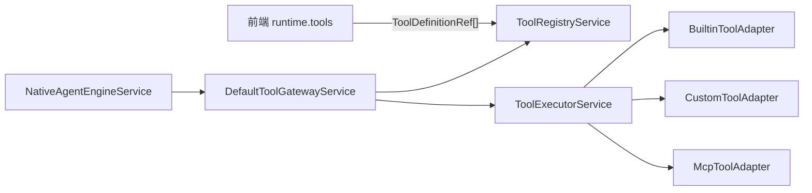

# Tool 工具开发操作手册 Skill 设计

生成日期：2026-06-06

## Summary

本文设计一份面向 Codex 使用的 `tool-development-manual` skill，用于在本仓库内规范化开发、改造、评审 AI 工具能力。它覆盖后端 `ai-proxy-server/src/tools/` 中的内置工具、自定义工具、MCP 工具接入，以及 Agent Runtime 通过 `ToolGateway` 调用工具的完整操作路径。

这份文档既是操作手册，也是可转写为 `SKILL.md` 的 skill 草案。后续若需要正式安装 skill，可基于本文的“SKILL.md 草案”创建到 `$CODEX_HOME/skills/tool-development-manual/SKILL.md`。

## Skill 定位

### 推荐名称

`tool-development-manual`

### 推荐触发描述

```yaml
name: tool-development-manual
description: 在 aiagent 仓库内开发、改造、接入或评审工具能力的操作手册。Use when Codex needs to add a builtin/custom/MCP tool, design tool schemas, wire tool registration/execution through ai-proxy-server, connect tools with Agent Runtime, update tool tests, review tool safety, or document tool development workflow in this repository.
```

### 适用场景

- 新增 `builtin` 工具，例如文件读取、时间查询、确定性内部工作。
- 接入 `custom` 工具，为后续用户自定义工具或业务扩展预留执行路径。
- 接入 `mcp` 工具，将外部 MCP Server 暴露的能力纳入工具注册表。
- 调整 `ToolRegistryService`、`ToolExecutorService`、`DefaultToolGatewayService` 的行为。
- 为 Agent Runtime 增加内部工具工作，例如 provider 请求前的上下文准备。
- 评审工具的输入 schema、权限边界、错误处理、测试覆盖和前端暴露策略。

### 非目标

- 不重新设计 v2 流式协议。
- 不让模型任意调用未注册工具。
- 不把敏感凭证、`.env`、用户文件原文写入文档或日志。
- 不绕开 `ToolRegistryService` 直接执行前端传入的任意 schema。

## 当前工具体系速览

### 核心模块

| 文件 | 职责 |
|------|------|
| `ai-proxy-server/src/tools/dto/tool-definition.dto.ts` | 定义 `ToolDefinition`、`ToolDefinitionRef`、`ToolExecutionRequest`、`ToolExecutionResult` |
| `ai-proxy-server/src/tools/tool-registry.service.ts` | 汇总 `builtin/custom/mcp` 工具；过滤公共工具；解析请求侧工具引用；查找内部工具 |
| `ai-proxy-server/src/tools/tool-executor.service.ts` | 统一分发工具执行；处理超时、异常和结果截断 |
| `ai-proxy-server/src/tools/adapters/builtin-tool.adapter.ts` | 注册并执行后端内置工具 |
| `ai-proxy-server/src/tools/adapters/custom-tool.adapter.ts` | 自定义工具 adapter 占位 |
| `ai-proxy-server/src/tools/adapters/mcp-tool.adapter.ts` | MCP 工具 adapter 占位 |
| `ai-proxy-server/src/agent-runtime/gateways/default-tool-gateway.service.ts` | Agent Runtime 使用的工具网关实现 |
| `ai-proxy-server/src/agent-runtime/ports/tool-gateway.port.ts` | 工具网关端口定义 |

### 数据流



### 公共工具与内部工具

- 公共工具：`enabled: true` 且没有 `internal: true`，会出现在 `GET /api/tools` 和 `resolveRequestedTools()` 的结果里。
- 内部工具：`enabled: true` 且 `internal: true`，不会暴露给前端，只能由后端通过 `findInternalTool()` 查找并执行。
- 请求侧只能传 `ToolDefinitionRef`，后端必须从注册表解析真实定义，避免前端伪造工具 schema。

## 工具开发标准流程

### 1. 明确工具类型

先判断工具属于哪一类：

| 类型 | 使用条件 | 推荐接入点 |
|------|----------|------------|
| `builtin` | 后端确定性能力、需要访问内部 service、权限边界强、实现稳定 | `BuiltinToolAdapter` |
| `custom` | 用户或业务配置的自定义工具，未来可由数据库/配置中心驱动 | `CustomToolAdapter` |
| `mcp` | 外部 MCP Server 提供的工具，需要通过 serverId 区分来源 | `McpToolAdapter` |

默认优先选择最小可控类型。需要访问数据库、文件、会话、凭证、用户权限的工具，优先做成 `builtin`。

### 2. 写清工具契约

每个工具必须先定义契约，再写执行逻辑：

- `source`：`builtin`、`custom` 或 `mcp`。
- `name`：小写蛇形命名，例如 `read_attached_files`。
- `description`：说明工具做什么、何时调用、输入限制。
- `inputSchema`：使用 JSON Schema 风格对象，明确 `required`、`properties`、`additionalProperties: false`。
- `enabled`：默认按是否可用设置。
- `internal`：只给后端 runtime 使用的工具必须设为 `true`。

推荐契约模板：

```ts
const EXAMPLE_TOOL: ToolDefinition = {
  source: 'builtin',
  name: 'example_tool',
  description: '执行某个确定性后端工作，用于某个明确场景。',
  inputSchema: {
    type: 'object',
    required: ['userId'],
    properties: {
      userId: {
        type: 'string',
        description: '当前请求用户 ID。',
      },
    },
    additionalProperties: false,
  },
  enabled: true,
  internal: true,
};
```

### 3. 实现参数解析

不要把 `request.arguments` 直接传给业务 service。先做最小必要校验和归一化：

- 字符串必须判空。
- 数组必须过滤非预期元素并去重。
- 数字必须确认范围。
- 枚举必须做白名单判断。
- 用户身份、文件 ID、会话 ID 不能信任前端自行拼接出的上下文。

参数非法时返回工具级错误，不要抛出会污染主流程语义的普通异常。

### 4. 实现执行逻辑

执行逻辑应保持以下约束：

- 成功时返回结构化 `result`，不要返回大段不可解析字符串。
- 业务不可用、输入不合法等可恢复问题返回 `error.code` 和 `error.message`。
- 系统级异常可以抛出，由 `ToolExecutorService` 统一包装成 `TOOL_EXECUTION_FAILED`。
- 长结果默认会被 `ToolExecutorService` 截断；只有确定内部链路必须完整结果时才设置 `skipResultTruncation`。
- 工具执行必须可审计，不要吞掉关键信息，也不要把敏感内容写入日志。

### 5. 注册工具

`builtin` 工具在 `BuiltinToolAdapter` 的 `definitions` 中注册，并在 `execute()` 中按 `tool.name` 分发。

新增工具时建议同步添加类型文件，例如：

```text
ai-proxy-server/src/tools/example-tool.types.ts
```

类型文件用于放置：

- 工具名常量。
- 入参接口。
- 结果接口。
- 结果类型守卫。
- 纯函数格式化逻辑。

### 6. 接入 Agent Runtime

公共工具由请求侧通过 `runtime.tools` 引用，后端走：

```ts
const requestedTools = this.toolGateway.resolveRequestedTools(input.dto.runtime?.tools ?? []);
```

内部工具由 runtime 主动查找：

```ts
const tool = this.toolGateway.findInternalTool('builtin', TOOL_NAME);
if (!tool) {
  throw new Error(`内部工具未注册：${TOOL_NAME}`);
}
```

执行时必须提供稳定 `toolCallId`，并传入已经校验过的参数：

```ts
const result = await this.toolGateway.execute({
  toolCallId: `internal_${TOOL_NAME}`,
  tool,
  arguments: {
    userId,
  },
  skipResultTruncation: true,
});
```

### 7. 输出到流式协议

如果工具结果需要展示到聊天流，必须通过现有 v2 message part 体系投影，不要重新引入旧 OpenAI-like SSE 累积格式。

推荐做法：

- 工具只返回结构化结果。
- Runtime 将工具结果写入运行状态。
- `agent-runtime-event-projector` 或相邻投影层负责转成 `message.part.*`。
- 前端继续通过 `stream-protocol.ts` 和 `MessagePartsRenderer` 渲染。

## 内置工具开发清单

### 必做项

- 在 `dto/tool-definition.dto.ts` 现有接口能表达需求时，不新增重复 DTO。
- 在 `BuiltinToolAdapter.definitions` 增加工具定义。
- 在 `BuiltinToolAdapter.execute()` 增加分发分支。
- 为复杂入参写私有 `parseXxxArguments()`。
- 为复杂结果写 `xxx-tool.types.ts`，并包含类型守卫。
- 在 `builtin-tool.adapter.spec.ts` 添加单元测试。
- 如果接入 runtime，在 `native-agent-engine.service.spec.ts` 或相邻可测单元补测试。
- 确认公共工具是否应出现在 `GET /api/tools`。

### 禁止项

- 禁止执行前端传入的完整工具 schema。
- 禁止把 `internal: true` 工具暴露给前端工具列表。
- 禁止在工具中绕过用户权限直接读取文件、会话或凭证。
- 禁止在工具结果中返回未裁剪的大型二进制内容。
- 禁止把工具失败直接伪装为模型回答成功。

## 测试策略

### 单元测试

优先覆盖以下行为：

- `ToolRegistryService.listTools()` 不返回内部工具。
- `ToolRegistryService.findInternalTool()` 能找到内部工具。
- `resolveRequestedTools()` 拒绝未注册、未启用或 serverId 不匹配的工具。
- `ToolExecutorService.execute()` 能按 source 分发。
- 工具超时、抛错、返回超长结果时行为符合预期。
- 具体 adapter 对合法参数、非法参数、业务失败和成功结果都有覆盖。

### 集成测试

当工具访问数据库、Redis、文件系统或队列时，补充 integration 测试。测试前按后端约定准备环境：

```bash
cd ai-proxy-server
pnpm test:env:up
pnpm test:db:migrate
pnpm test:integration
```

### 最小验证命令

普通内置工具改动建议至少运行：

```bash
cd ai-proxy-server
pnpm test:unit
pnpm build
```

涉及前端工具列表或工具选择 UI 时追加：

```bash
cd antdXStudy
pnpm test:unit
pnpm build
```

## 安全与权限检查

开发或评审工具时，逐项确认：

- 工具是否需要 `userId`、`sessionId`、`fileId` 等权限上下文。
- 工具是否只能访问当前用户拥有的资源。
- 工具是否可能泄露 `.env`、API Key、上传文件原文或数据库敏感字段。
- 工具执行失败时，用户看到的错误是否足够明确但不过度泄露内部细节。
- 工具结果是否可能超过 token 或响应大小预算。
- 工具是否会触发外部网络、写文件、删除数据或修改生产状态。
- destructive 行为是否有明确用户确认和审计记录。

## 文档更新规范

新增或改造工具后，按影响范围更新文档：

- 后端工具契约变化：更新 `docs/` 下对应方案或规范。
- 前端可见工具变化：更新工具列表 UI 或相关页面说明。
- 流式输出变化：更新 v2 协议相关文档。
- 文件工具变化：同步说明 `SessionFile` 与 `MessageFile` 的语义是否变化。

文档应使用简体中文，避免记录真实 API Key、真实用户数据和 `.env` 内容。

## SKILL.md 草案

下面内容可作为正式 skill 的 `SKILL.md` 起点。

```markdown
---
name: tool-development-manual
description: 在 aiagent 仓库内开发、改造、接入或评审工具能力的操作手册。Use when Codex needs to add a builtin/custom/MCP tool, design tool schemas, wire tool registration/execution through ai-proxy-server, connect tools with Agent Runtime, update tool tests, review tool safety, or document tool development workflow in this repository.
---

# Tool Development Manual

## Quick Start

Use this skill when working on tools in `ai-proxy-server/src/tools/` or tool calls from `ai-proxy-server/src/agent-runtime/`.

First inspect:

- `ai-proxy-server/src/tools/dto/tool-definition.dto.ts`
- `ai-proxy-server/src/tools/tool-registry.service.ts`
- `ai-proxy-server/src/tools/tool-executor.service.ts`
- `ai-proxy-server/src/tools/adapters/builtin-tool.adapter.ts`
- `ai-proxy-server/src/agent-runtime/gateways/default-tool-gateway.service.ts`
- `ai-proxy-server/src/agent-runtime/ports/tool-gateway.port.ts`

## Decide Tool Type

- Use `builtin` for deterministic backend tools that need internal services, permissions, or stable execution.
- Use `custom` for future user/business-configured tools.
- Use `mcp` for external MCP server tools; require `serverId` when matching MCP tools.

Prefer `builtin` when the tool reads files, sessions, messages, credentials, database rows, Redis state, or any user-scoped resource.

## Define Contract Before Code

Create a `ToolDefinition` with:

- `source`
- `name`
- `description`
- `inputSchema`
- `enabled`
- `internal` when the tool is backend-only

Set `additionalProperties: false` in `inputSchema`. Never execute a schema supplied directly by the frontend. Frontend requests may only send `ToolDefinitionRef`; backend must resolve the real definition through `ToolRegistryService`.

## Implement Builtin Tools

For a new builtin tool:

1. Add the definition to `BuiltinToolAdapter.definitions`.
2. Add an `execute()` branch by `request.tool.name`.
3. Parse and validate `request.arguments` in a private parser.
4. Return structured `result` or tool-level `error`.
5. Put complex names, arguments, results, guards, and pure formatters in `src/tools/*-tool.types.ts`.
6. Add tests in `builtin-tool.adapter.spec.ts`.

Use `internal: true` for tools that only runtime should call. Internal tools must not appear in `GET /api/tools`.

## Execute Tools

Use `DefaultToolGatewayService` from Agent Runtime:

- Public requested tools: `resolveRequestedTools(input.dto.runtime?.tools ?? [])`
- Backend-only tools: `findInternalTool(source, name, serverId?)`
- Execution: `toolGateway.execute({ toolCallId, tool, arguments, skipResultTruncation? })`

Use stable `toolCallId` values for internal work. Set `skipResultTruncation: true` only when the internal chain requires complete structured output.

## Error Handling

- Return tool-level `error` for invalid arguments or recoverable business failures.
- Let unexpected system exceptions be wrapped by `ToolExecutorService`.
- Do not leak secrets or raw internals in `error.message`.
- Keep large results structured and bounded; the executor truncates oversized results by default.

## Runtime And Streaming

Do not reintroduce old OpenAI-like accumulated SSE formats.

If a tool result must be shown in chat:

1. Keep tool output structured.
2. Store the result in runtime state.
3. Project it into existing v2 `message.part.*` events through the runtime projector or adjacent streaming layer.
4. Keep frontend protocol types in `antdXStudy/src/service/stream-protocol.ts` aligned with backend types.

## Test Checklist

Run focused tests first, then build:

```bash
cd ai-proxy-server
pnpm test:unit
pnpm build
```

Add integration tests when the tool touches PostgreSQL, Redis, filesystem, queue, external APIs, or cross-module permissions.

When tool UI or frontend service code changes, also run:

```bash
cd antdXStudy
pnpm test:unit
pnpm build
```

## Safety Checklist

Before finishing, verify:

- Public tools are intentionally public.
- Internal tools have `internal: true`.
- User-scoped resources are checked by user/session ownership.
- Tool inputs are parsed and normalized.
- Tool outputs do not expose credentials, `.env`, private files, or excessive raw content.
- Failure paths are tested.
- Documentation is updated when protocol, API, or user-visible behavior changes.
```

## 推荐 Skill 目录

如果要正式创建 skill，推荐目录如下：

```text
tool-development-manual/
├── SKILL.md
└── references/
    ├── aiagent-tool-architecture.md
    └── builtin-tool-checklist.md
```

第一版可以只创建 `SKILL.md`。当工具体系继续扩展，或 MCP/custom 工具细节明显增多时，再把架构说明和清单拆入 `references/`，保持 `SKILL.md` 精简。

## 后续迭代建议

- 当 `CustomToolAdapter` 或 `McpToolAdapter` 有真实实现后，补充专门章节。
- 当工具调用结果进入模型 function/tool-call 标准格式后，补充 provider adapter 映射规则。
- 当工具权限模型独立成 guard/policy 后，补充权限矩阵和审计规范。
